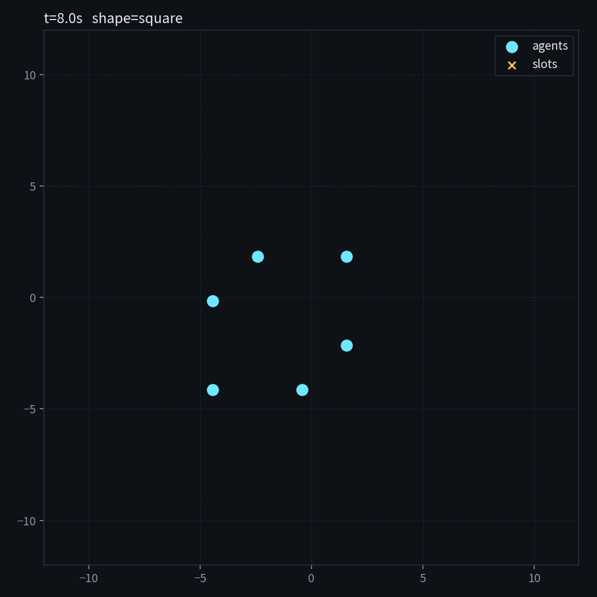

# formation-sim

Simulated agents share pose over an unreliable radio and hold a geometric formation.

This is a software study, not an aircraft. Nothing here flies.

## What it does

- N point-mass agents start scattered on a plane.
- Each tick, every agent broadcasts `(id, t, x, y, vx, vy)`.
- Packets drop at a set rate. An agent only plans from packets it actually received.
- Each agent estimates the swarm centroid from what it has heard, then steers toward an assigned slot on a line / triangle / square / circle.
- Mid-run the shape can switch. Slots are reassigned greedily so two agents do not claim the same vertex.

## Run

```bash
python -m venv .venv
source .venv/bin/activate
pip install -r requirements.txt
python main.py --n 6 --shape triangle --change-to square --drop-rate 0.2
```

Useful knobs:

```bash
python main.py --n 8 --shape circle --change-to line --drop-rate 0.0
python main.py --n 5 --shape square --drop-rate 0.45 --seconds 20
```

## Technical note

The easy version of this demo cheats: every agent reads the true positions from a shared array. That is a visualization, not a multi-agent system.

Here the radio is a separate object. Control uses `last_seen` plus own state. Raise `--drop-rate` and the formation lags and breathes; that lag is the result, not a bug.

Assignment still uses true positions to pick slots. That is a deliberate shortcut so the geometry stays well-posed when packets vanish. A next step is consensus on slot IDs over the same radio.

## License

MIT
